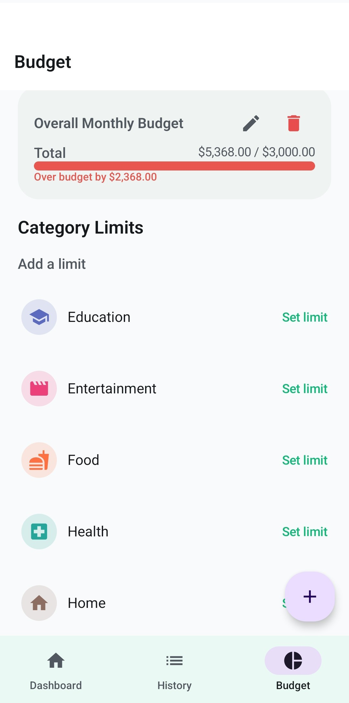
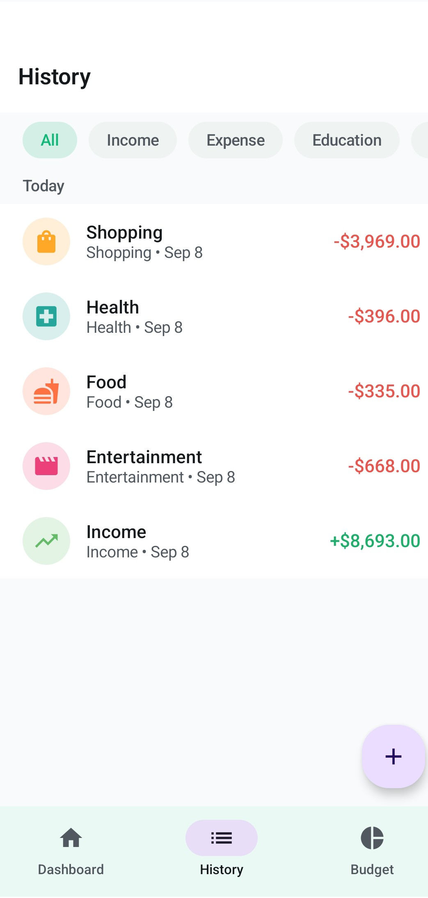
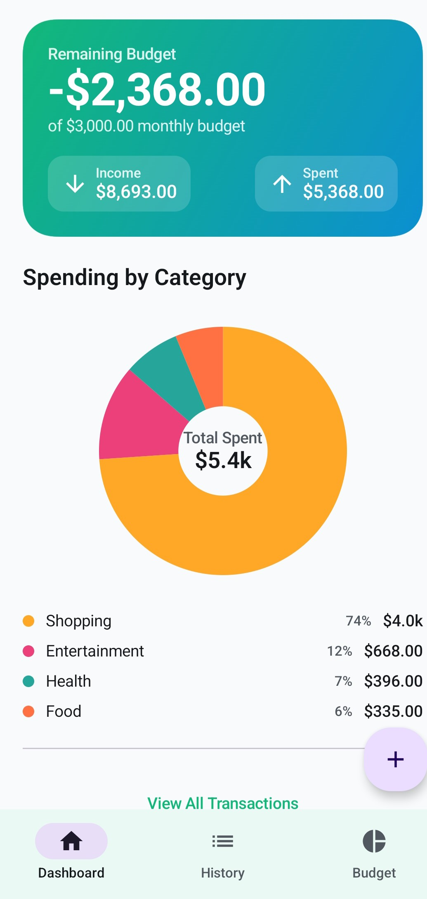

# ByteSpend — Minimalist Expense & Budget Tracker

A production-ready Android app built with 100% Kotlin, Jetpack Compose,
and Material Design 3 — MVVM + Clean Architecture, Room database,
zero backend required.

**Full source code available on Gumroad → [link]**

## Features

- 📊 Fully custom-drawn, animated pie chart (no charting libraries)
- 💰 Income/expense tracking with category filtering
- 📅 Grouped transaction history with swipe-to-delete
- 🎯 Overall + per-category budget limits with live progress bars
- 🌗 True-black OLED dark mode + light theme
- 🏗️ Clean Architecture: UI → ViewModel → Repository → Room

## Tech Stack

Kotlin · Jetpack Compose · Material 3 · Room · Coroutines & StateFlow ·
Navigation Compose

## Screenshots

| Dashboard | Add Transaction | Budget |
|---|---|---|
|  |  |  |

## Get the full source

This repo showcases the architecture and design. The complete,
buildable Android Studio project (39 files, fully commented) is
available here:

👉 **[Get ByteSpend on Gumroad](https://nmutdbiz.gumroad.com/l/asxtpe)**
👉 **[Get ByteSpend on Buy Me a Coffee](https://buymeacoffee.com/nm_utd/e/573827)**

## License

This preview repository is shared for demonstration purposes.
The purchased source code comes with a personal + commercial use
license — see the product page for full terms.
